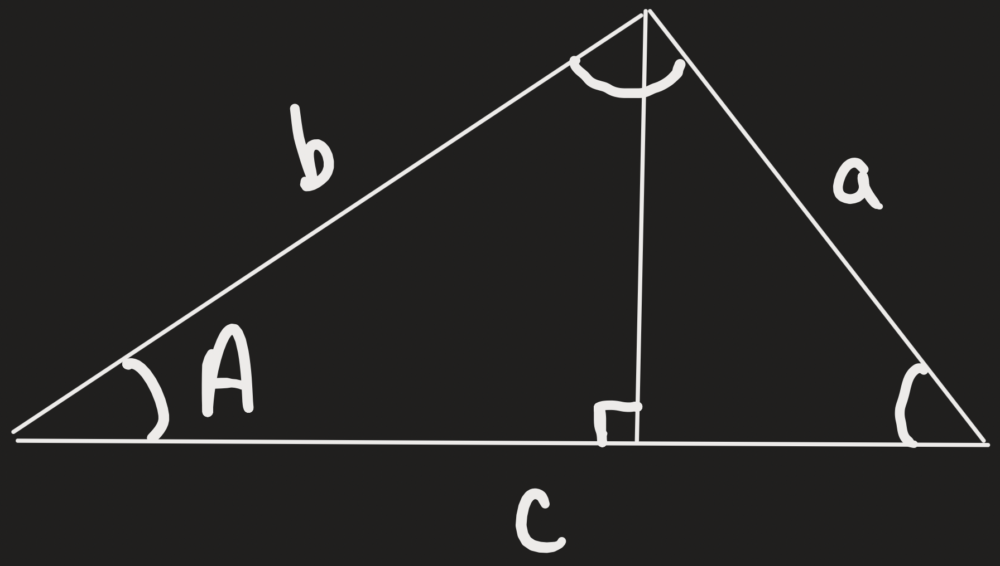

# Ambiguous Case (SSA) – Height Method

This table summarizes how to determine 0, 1, or 2 triangles using the height method for **SSA** (Side-Side-Opposite Angle) triangles.

| Step | Action | Formula / Notes | Result / Decision |
|------|--------|----------------|-----------------|
| 1 | Identify SSA | Two sides (**a**, **b**) and an angle (**A**) opposite **a** | Only SSA is ambiguous; all other cases (ASA, AAS, SAS, SSS) → 1 triangle |
| 2 | Draw auxiliary right triangle | Drop a perpendicular from the endpoint of side **b** to the ray forming angle **A** | Creates right triangle including angle A; helps find height |
| 3 | Compute height | \( $h = b \times sin(A)$ \) | Minimum length **a** must reach base |
| 4 | Compare **a** to **h** and **b** | - If \( a < h \) → too short - If \( a = h \) → right triangle - If \( h < a < b \) → swings to two positions - If \( $a \ge b$ \) → reaches only one way | Determines # of triangles: 0, 1, 2, or 1 |

  

    
  

  

**Quick Summary:**  

\[
$h = b \times sin A$
\]  

| a vs h / b | # Triangles |
|------------|-------------|
| a < h | 0 |
| a = h | 1 (right triangle) |
| h < a < b | 2 |
| a ≥ b | 1 |
  

